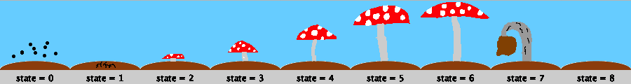
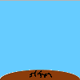
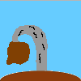

# Macquarie University, WCOM115 Introduction to Computer Programming, Assignment 2 (Term 2, 2018)

# LoveMushRoom

pongsak.suvanpong@mq.edu.au

[My version of the solution is here](https://github.com/psksvp/A2/blob/master/LoveMushroom.pde)

## Introduction
In this assignment you will use all your knowledge that you have learned in this unit to write a simple game to simulate growing mushrooms. The player will need to grow, looking after and harvesting mushrooms. 

In general, the game presents the player with a grid. Each cell in the grid is where the player will grow a mushroom. When the mouse pointer is hovering on a cell, the cell is *focused* (drawn with a white rectangle). While a cell is focused, the player can *seed* the mushroom spore by pressing the 's' key. The 'h' key allows the player to *harvest* the mushroom when the mushroom is in the *Ready* state. Mushrooms like moisture, the 'w' key increases moisture level but if it is far too much or too dry, the mushroom will die. The 'c' key clears the focused cell if there is any mushroom. Seeding, clearing and watering costs money and harvesting earns money to the player. The mushroom grows in six states; sporing, rooting, G1, G2, G3, G4, ready, dead and empty. 

The video below illustrates the game play when all the tasks has been implemented. The video is for illustration purpose, it is not this assignment specification. You **must read** the specification.

| |
|--------------------------------------------------------------------------------------------------------------------|
|The video is for only illustration purpose, it is not this assignment specification. You must read the specification and follow it closely.                                                                                 |

## Instructions

1. The due date of this assignment is **week 6 Wed May 9, 2018 at 11:45pm**. Late submissions are possible and will be penalized at 20% of assignment total mark per day up to 4 days (weekend inclusive). If a student submits an assessment 5 or more days a after the due date without grounds for special consideration (See Disruptions to` Studies Policy) a record or submission will be made but the student will receive zero marks for the assessment task. 
2. Student are required to keep a copy of all items submitted or completed for the purpose of assessment or evaluation until the end of the grade appeal period.
3. Marks and feedback will be provided via iLearn.
4. The demonstration video is provided for illustration purpose only. You must not use it as the specification of this assignment.
5. This assignment must be done in processing language (processing.org).
6. This assignment weights 20% and it is not a hurdle.

### Academic Honesty
Using the work or ideas of another person, whether intentionally or not, and presenting them as your own without clear acknowledgement of the source is called Plagiarism.
Macquarie University promotes awareness of information ethics through its Academic Honesty Policy. This means that:

* all academic work claimed as original must be the work of the person making the claim
* all academic collaborations of any kind must be acknowledged
* academic work must not be falsified in any way
* when the ideas of others are used, these ideas must be acknowledged appropriately.
All breaches of the Academic Honesty Policy are serious and penalties apply. Students should be aware that they may fail an assessment task, a unit or even be excluded from the University for breaching the Academic Honesty Policy.

### Expectation of Students
Students are responsible for their learning and are expected to:

* actively engage with assessment tasks, including carefully reading the guidance provided,
understanding criteria, spending sufficient time on the task and submitting work on time; Read, reflect
and act on feedback provided;
* Actively engage in activities designed to develop assessment literacy, including taking the initiative
where appropriate (e.g. seeking clarification or advice, negotiating learning contracts, developing grading criteria and rubrics);
* Provide constructive feedback on assessment processes and tasks through student feedback mechanisms (e.g. student surveys, suggestions for future offerings, student representation on committees);
* Ensure that their work is their own; and
* Be familiar with University policy and faculty procedures and act in accordance with those policy and procedures.

### Start up code
To assist you in doing this assignment, I have coded a function to draw a mushroom in its various stages while it is growing. Please download the zip file from **[here](LoveMushroom.zip)**. Unzip the [file](LoveMushroom.zip) (on Windows OS, right click on the zip file and select "extract all"). If you unzip correctly, the directory structure should look like below.

~~~
+-A2Mushroom
  |  +-LoveMushroom
  |  |  +-LoveMushroom.pde
  |  |  +-drawMushroom.pde
  |  |  +-data
  |  |  |  +-mushroomgrid.png
~~~

The file that you need to edit and implement this game is in the sub directory *LoveMushroom*, the name of the file is *LoveMushroom.pde*. You must implement all the tasks in this one single file.

The file *drawMushroom.pde* contains a function *void drawMushroom(float x, float y, float w, float h, int state)* which I have coded. When called, it draws a mushroom into a rectangle area specified with the parameters *x, y, w* and *h* where *x* and *y* are the top left corner and *w* and *h* are the width and height of the rectangle. The parameter *state* specifies the growing stage of the mushroom to be drawn. Its value can be between 0 and 8 inclusive. Each corresponds to growing state: *sporing (0), rooting (1), G1 (2), G2 (3), G3 (4), G4 (5), ready (6), dead (7) and empty (8)*. The image below illustrates calling function *void drawMushroom(float x, float y, float w, float h, int state)* drawing mushroom in each of the growing stage.

|             |
|------------------------------|
|Mushroom states.              |

The example code below draws a mushroom in state G2 at coordinate (50, 50) with width and height at 100 pixels.

~~~java
void setup()
{
  size(400, 400);
}

void draw()
{
  background(255);
  drawMushroom(50, 50, 100, 100, 3);   
}
~~~

### Penalty 

Up to 20 marks will be deducted from your total marks if you do not do the below requirements.

* You must submit only one file and it must be named **LoveMushroom.pde**. The file must contain all the code which is your implementation of this assignment. You do not need to include any other files : *drawMushroom.pde* and *mushroomgrid.png*.
* In that file, your must put your **name** and **id** as a comment at the top of your code.
* The code that you submit must have readable layout. 
* The code should have proper and enough commenting. 

### Code with compilation errors 
Any submission with compilation error(s) will not be marked. The responsibility of ensuring that the uploaded code has zero syntax error is your.

## Tasks
The tasks have been divided in a logical order (from easy to hard) for you to follow. You must do the tasks based on the order that we have given you. For example you must not do task 2 if you have not accomplish task 1. The task specification is below.

### Task 1: The Foundation
In this task you will write code for the base foundation of this game. Growing mushroom requires *grid of cells*. A cell is a rectangle. Each cell is where the player will grow a mushroom.

* Draw a grid, the size (number of rows and columns) of the growing grid must be configurable using global variables. The width and height of each cell should scale to the size of the graphic screen with respect to the number of rows and columns.
* When the player clicks the left mouse button on a cell in the grid, the game should print a message showing the row and column index of the cell to the console area of processing IDE. (For debugging purpose)
* The player will move the mouse over the grid to interact. When the mouse pointer is hovering on top of a cell in the grid (mouseMoved), the game should show the focus by drawing a white border around the cell.

**Hints**

* The example code for drawing a grid is in the sudoku board example.
* The row and column index of a cell from mouse position can be calculated using the formulas below:

~~~
rowIndex = (mouseY - gy) / cellHeight
columnIndex = (mouseX - gx) / cellWidth 
~~~

where *gx* and *gy* are the top left coordinate of the grid.

### Task 2: The Status

The game needs to show its status to the player. The status includes *money*, *focus cell row and column index* and *game time*. The look and feel of the status display is up to your imagination and creativity. However it must display the following information and is updated to the lasted information from the game state and does not cover the growing grid.

* The top of the status must show your name and last name.
* Money: When the game start, the player is given 200 coins.
	* Seeding a cell costs 10 coins. 
	* Clearing a cell costs 2 coins. 
	* Watering (to increase moisture) a cell costs 2 coins. 
	* Harvesting a cell with a mushroom in the *Ready* state earns 20 coins.
* Cell Focus: When the player hovers the mouse over a cell, the status should display the row and column index of the cell and the current state of the cell (sporing, rooting, G1, G2, G3, G4, ready, dead and empty).
* Game Time: A day (*oneDay*) in the simulation equals to 1600 frames. The Processing library has an internal variable *frameCount* which automatically increases each time function *void draw()* is called. Thus The current game day can be calculated using the formula below 
	* *today = frameCount / oneDay*.
* The look of the status must not look like my status in the demo video and should be fairly unique.

**Hints**

Each of the status is just a global variable of type *int*.

### Task 3: The State Memory

The cells in the grid are where player will grow mushrooms. In this game, a mushroom grows in 9 states. A state can be represented using an integer number : *sporing (0), rooting (1), G1 (2), G2 (3), G3 (4), G4 (5), ready (6), dead (7) and empty (8)*.

* Declare a two dimension array which its size equals to the number of rows and columns of the grid. The array will be used to store the mushroom state.
* Initially all the elements of the array is -1 which means all the cells are *cleared* (implies, the cells are not used).
* The content of a cell is drawn according to the table below.

|state   | value | image
|--------|-------|-----------------------------------
|cleared |-1     |
|sporing | 0     |
|rooting | 1     |
|G1      | 2     |
|G2      | 3     |
|G3      | 4     |
|G4      | 5     |
|ready   | 6     |
|dead    | 7     |
|empty   | 8     |

### Task 4: The Seeding 

When this game is running, the player will interact with the game using a mouse and a keyboard. When the mouse is hovering over a cell, there are several thing that the player can do to the focused cell. These are **Seeding**, **Watering**, **Harvesting** and **Clearing**.

* Using the keyboard interaction, if the player presses the 's' key and the focused cell is in the *cleared* state, then the cell should be in the *sporing* state. 10 coins is deducted from the total coin.
* If the play presses the 'c' key, the cell changes to the *clear* state. 2 coins is deducted from the total *money*.
* The grid should be updated both visually and logically according to the state array.
* Make sure that if there is not enough coins, the game must not allow the player to seed and clean the cell.

### Task 5: The Basic Grower

A mushroom grows from one state to another once every game day. When a game day is over, your code must iterate through each cell in the grid and change the state of each cell based on the description below.

* If the state of a cell is *cleared* or *empty*, the cell remains in the same state.
* Other wise change the cell to the next state. For example if a cell is in *sporing* state, it changes to *rooting* state.
* The display of the content of the grid updates accordingly.

### Task 6: The Harvesting

A mushroom can be harvested when it is in the *Ready* state. 

* Using the keyboard interaction, if the player presses the 'h' key on a focused cell and the cell state is in the *Ready* state, the mushroom in the cell is harvested. 
* Once a cell is harvested, the cell state changes to the *empty* state. 
* 20 coins are added to the total *money*.

### Task 7: The Intermediate Grower

The basic grower is very basic, all the mushroom changes its state at the exact same time at the end of each game day even-though each may be seeded at the different time. This makes the game unrealistic.

* Declare a two dimension array of type *int*. Its size (number of rows and columns) should be the same as the size of the grid.
* Initialize the contents of the array with -1.
* When a mushroom is seeded in a cell, the element of the array at the same row and column index should be set to the value of Processing's internal variable *frameCount*.
* The mushroom now changes its state only when the boolean condition below is true. 
	* *0 == frameCount - seedingTime % oneDay*
	* where *seedingTime* is the element of the array at the corresponding row and column index.
* When a cell (at row and column) is cleared, the content of the row and column index in this array is set to -1.

### Task 8: The Watering

In general mushrooms like moisture. However too much moisture or too dry will harm it. In this task you will add a feature which allows the player to add moisture.

* Declare a two dimension array of type *float*. Its size (number of rows and columns) is the same as the size of the grid.
* Initialize the contents of the array with 0.0.
* When a mushroom is seeded in a cell, the element of the array at the same row and column index should be set to 50 (50% moisture).
* In each *game day*, each cell loses its moisture by 30%. However its lower bound is zero and upper bound to 100%. In other words the *moisture* level cannot be a negative number or more than 100.
* The player adds moisture to a cell by focusing the mouse over the cell and presses the 'w' key. This increases moisture level by 30%.
* Each time when the player adds moisture, it costs 2 coins.
* The status should display the amount moisture of each cell accordingly when a cell is focused.
* Cells that are currently in state *Cleared* must not be allowed to add moisture.
* Make sure that if there is not enough coins, the game must not allow the player to water the cell.

### Task 9: The Advance Grower

In task 8, we have added a feature which allows the player to add moisture. However, the game behavior is still the same as before we add the watering feature.

* Recall from task 7 that a mushroom changes its state when the following condition is true:
	* *0 == frameCount - seedingTime % oneDay*
	* where *seedTime* is the element of the array at the focused row and column.
	* Add a feature that when the above boolean is true, it should also check that if the moisture of the cell is below 20% or above 90%, the cell changes to *dead* state. 
* Otherwise, the cell moves to the next state normally.

## Marking Guide
[csv file](MarkingGuide.csv)

| **Tasks** | **Mark**|
|---|---|
| Task 1: The Foundation |  |
| Configurable  Growing Grid | 5 |
| MouseClicked show row and column index in console windows | 5 |
| MouseMoved shows focus | 5 |
|  |  |
| Task 2: The Status |  |
| The top of the status must show your name and last name. | 1 |
| Variable declared with correct type for *money* | 1 |
| Show focused cell informations (row and col) when mouse hover over a cell | 3 |
| Calculate and show Game day | 5 |
|  |  |
| Task 3: The State Memory |  |
| Declared 2D array with correct type and size to store mushrooms’ growing state | 1 |
| Initially all the elements of the array is -1 which means all the cells are cleared (implies, the cells are not used). | 1 |
| The content of a cell in the grid is drawn according to the state of each cell. (need to inspect code) | 3 |
|  |  |
| Task 4: The Seeding |  |
| Using the keyboard interaction, if the player presses the 's' key and the focused cell is in the cleared state, then the cell should be in the sporing state. 10 coins is deducted from the total *money*. | 3 |
| If the play presses the 'c' key, the cell changes to the clear state. 2 coins is deducted from the total coin. | 3 |
| The grid should be updated both visually and logically according to the state array. | 3 |
| Make sure that if there is not enough coins, the game must not allow the player to seed and clean the cell. | 3 |
|  |  |
| Task 5: The Basic Grower |  |
| If the state of a cell is *cleared* or *empty*, the cell remains in the same state. Other wise change the cell to the next state. For example if a cell is in *sporing* state, it changes to *rooting* state. | 5 |
| Mushrooms in the grid evolve at the end of each game day. | 5 |
| The display of the content of the grid updates accordingly. | 5 |
|  |  |
| Task 6: The Harvesting |  |
| Using the keyboard interaction, if the player presses the 'h' key on a focused cell and the cell state is in the *Ready* state, the mushroom in the cell is harvested. | 3 |
| Once a cell is harvested, the cell state changes to the *empty* state. 20 coins are added to the total coin. | 3 |
|  |  |
| Task 7: The Intermediate Grower |  |
| Declared 2D array with correct type and size to store mushrooms’ seeding time. | 3 |
| When a mushroom is seeded in a cell, the element of the array at the same row and column index should be set to the value of Processing's internal variable *frameCount*. | 3 |
| The mushroom now changes its state only when *0 == frameCount - seedingTime % oneDay* is true where *seedingTime* is the element of the array at the corresponding row and column index. | 5 |
| When a cell (at row and column) is cleared, the content of the row and column index in this array is set to -1. | 3 |
|  |  |
| Task 8: The Watering |  |
| Declared 2D array with correct type and size to store moisture level of each growing mushrooms. Initialize the contents of the array with 0.0 | 2 |
| When a mushroom is seeded in a cell, the element of the array at the same row and column index should be set to 50 (50% moisture) | 2 |
| In each *game day*, each cell loses its moisture by 30%. However its lower bound is zero and upper bound to 100%. In other words the *moisture* level cannot be a negative number or more than 100. | 5 |
| The player adds moisture to a cell by focusing the mouse over the cell and presses the 'w' key. This increases moisture level by 30%. Cells that are currently in state *Cleared* must not be allowed to add moisture. Make sure that if there is not enough coins, the game must not allow the player to water the cell. | 5 |
| Each time when the player adds moisture, it costs 2 coins and should be deducted from *money* | 2 |
| The status should display the amount moisture of each cell accordingly when a cell is focused. | 2 |
|  |  |
| Task 9: The Advance Grower |  |
| if the moisture of the cell is below 20% or above 90%, the cell changes to *dead* state. | 5 |
|  |  |
| Total | 100 |

 

